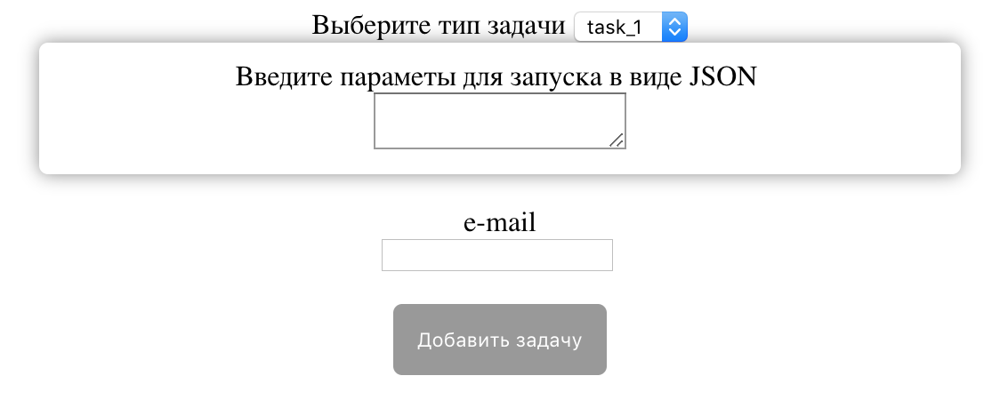

# HardWorker-example

Для удобства использования библиотеки [hardworker](https://github.com/Snusmumrick/HardWorker) было разработан веб-интерфейс, со следующим функционалом:

* Возможность просмотра списка зарегистрированных типов задач и их ограничения на количество одновременных запусков (если имеются);
* Возможность просмотра всей информации о задачах. Задачи разделены на 4 категории, в зависимости от своего статуса.
* Запуск задачи. Если у задачи была json-схема, то поля создаются автоматически, в противном случае создаётся одно поле для ввода параметров с помощью JSON.

### Для запуска необходимо установить библиотеку и в файле main.py ввести свои данные для почтового сервера

## Заданные таски

В данном примере демонстрируются различные способы задания тасков. Во всех функциях вручную добавлена задержка, для симуляции "тяжёлых задач".

```
@task("task_1")
def task1(params):
    """
    Возвращает случайное число после паузы. Длительность паузы задаётся пользователем.
    :param params:
    :return:
    """
    time_for_sleep = params[u'time']
    time.sleep(time_for_sleep)
    return random.randrange(0, 120)


@task("task_2", json_schema={'type': 'object', 'properties': {u'n': {'type': 'number'}}})
def task_2(params):
    """
    Возвращает n-ое число Фибоначчи
    :param params:
    :return:
    """
    def generate_fib(n):
        if n == 0 or n == 1:
            return 1
        else:
            return generate_fib(n - 1) + generate_fib(n - 2)
    answ = generate_fib(params[u'n'])
    time.sleep(answ)
    return answ


class MyTask(BaseTask):
    name = 'task_3'
    json_schema = {}

    def run(self, params):
        """
        Возвращает факториал числа
        :param params:
        :return:
        """
        def generate_fac(n):
            if n == 0:
                return 1
            else:
                return n * generate_fac(n - 1)

        f = open("output.txt", "w")
        f.write("Факториал {} = {}".format(params[u'n'], generate_fac(params[u'n'])))
        f.close()
        time.sleep(params[u'n'])
        return {"result": u"Факториал посчитан", "file_path": os.path.abspath("output.txt")}
        
```

## Пути для просмотра

| Адрес       	| Функционал 			                         |
|-------------	|--------------------------------------------|
| `/status`   	|Полнная информация о задачах                |
| `/tasks`    	|Список зарегистрированных типов задач       |
| `/add_task` 	|Запуск задачи                               |

## Просмотр списка зарегистрированных типов задач


## Просмотр задач

При первом запуске, перед добавлением задач, таблица выглядит так:


В процессе работы она выглядит примерно так:


Поле, если результат включает в себя файл выглядит так:


## Запуск задачи

В случае `task_2` при создании была указана JSON-схема, она была распарсена и форма для добавления задачи выглядит так:


У других задач схемы не было, поэтому формы у них внешне одинаковые и выглядят так:


